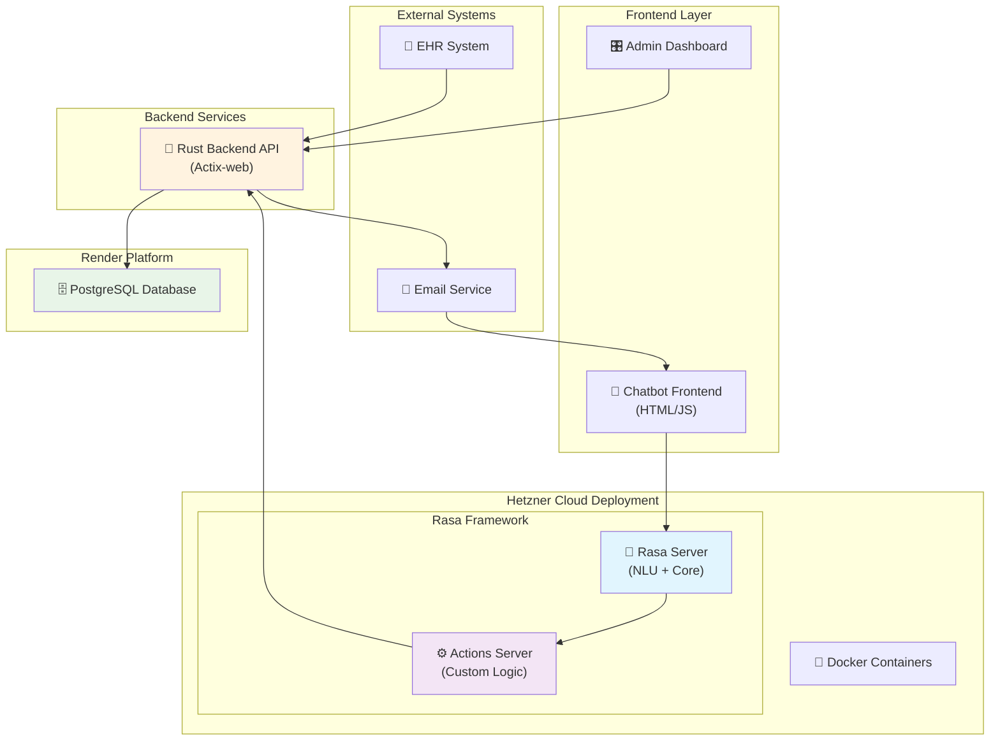
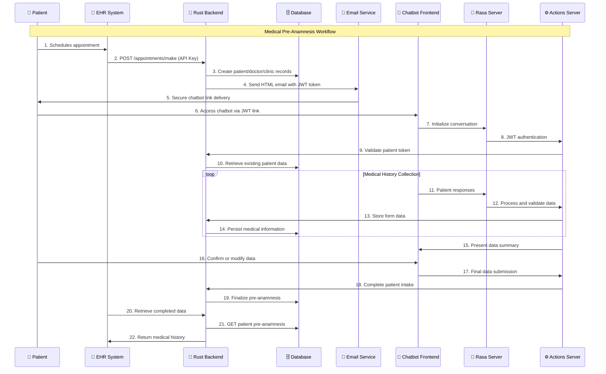
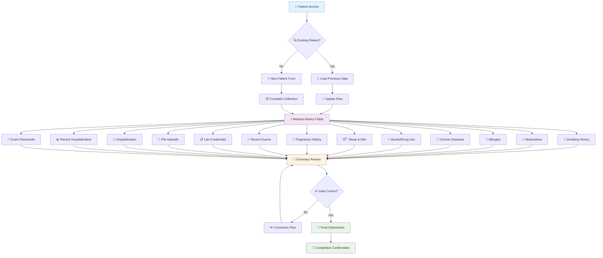
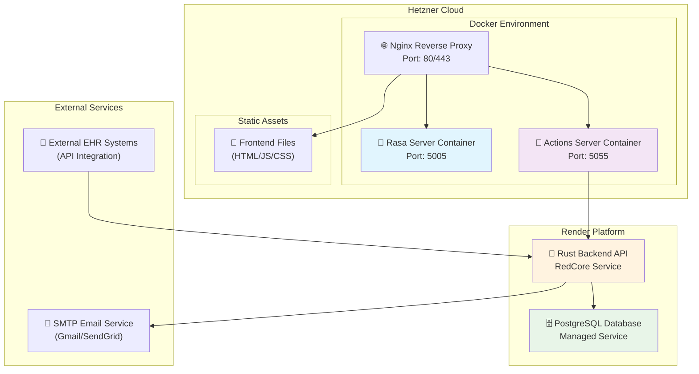

# Project Overview - Medical Pre-Anamnesis Chatbot System

## Overview

The Medical Pre-Anamnesis Chatbot System is a comprehensive healthcare solution designed to streamline patient intake processes through conversational AI. The system automates medical history collection, reducing administrative burden on healthcare providers while improving patient experience through intuitive chat-based interactions.

## Important Information for Exam
### To Use the Chatbot
Look for an email from digitalproductcats@gmail.com containing your secure chatbot access link.
### To Check API Working
Access the admin dashboard at: https://redcore-latest.onrender.com/
You can create an account there, which will come with dummy patients, or use the following test credentials:

Username: test
Password: ZbGD42a4p&0z

Here you can check the Rust-Backend working and API functionalities.

**Important Security Note**
You MUST access the chatbot through the email link due to JWT token authentication requirements. Direct access without the token will not work.

## System Architecture

### High-Level Architecture

## Core Components

### 1. Rasa Framework (Deployed on Hetzner Cloud)

The chatbot is built using the **Rasa 3.1 framework** and fully deployed on Hetzner in Docker containers, Push requests to master branch automatically deploy in Hetzner. There are two main components:

#### **Rasa Server**
- **Purpose**: Handles Natural Language Understanding (NLU) and conversation management
- **Responsibilities**:
  - Intent classification from user messages
  - Entity extraction (medical terms, patient responses)
  - Conversation flow management
  - Context tracking throughout the medical history collection
  - Form handling for structured data collection
- **Key Files**:
  - `domain.yml` - Defines intents, entities, slots, and conversation structure
  - `nlu.yml` - Training data for intent classification and entity extraction
  - `rules.yml` - Conversation flow rules and policies

#### **Actions Server**
- **Purpose**: Executes custom business logic and external integrations
- **Responsibilities**:
  - JWT token authentication and patient verification
  - Database operations through Rust backend API calls
  - Patient data retrieval and storage
  - Form validation and conditional logic
  - File upload handling for medical documents
  - Data summarization and confirmation workflows
- **Key Actions**:
  - `ActionGreetWithJWT` - Patient authentication
  - `ActionCheckPatientData` - Existing patient data verification
  - `ActionSavePatientData` - Medical history persistence
  - `ActionSummary` - Data review and confirmation
  - `ValidateMedicalHistoryForm` - Complex form validation

### 2. Frontend Interface

#### **Chatbot Frontend (HTML/JavaScript)**
- **File**: `chatbot.html` with accompanying JavaScript
- **Features**:
  - Responsive chat interface for patient interaction
  - JWT token handling for secure authentication
  - File upload capabilities for medical documents
  - Real-time conversation with Rasa server
  - Mobile-responsive design for accessibility

#### **Admin Dashboard**
- **Purpose**: Administrative interface for healthcare providers
- **Features**:
  - Patient database viewing and management
  - API testing interface
  - System statistics and monitoring
  - Clinic and doctor management

### 3. Rust Backend API (RedCore)

#### **Technology Stack**
- **Framework**: Actix-web 4.0 with Tokio async runtime
- **Database**: PostgreSQL integration with SQLx
- **Authentication**: JWT tokens + API keys + Argon2 password hashing
- **Email**: Lettre with HTML templates
- **Deployment**: Multi-stage Docker build with minimal container (~20MB)

#### **Core Responsibilities**
- **EHR Integration**: Primary endpoint for external health record systems
- **Patient Management**: CRUD operations for patient data
- **Authentication**: Multi-tier security (JWT, API keys, admin authentication)
- **Email Services**: Automated patient notifications with secure tokens
- **File Management**: Medical document upload and retrieval
- **Data Validation**: Comprehensive request validation and error handling

### 4. Database Layer (Render Platform)

#### **PostgreSQL Database**
- **Hosting**: Render cloud platform
- **Key Tables**:
  - `patients` - Patient demographics and information
  - `pre_anamnesis` - 13-field medical history data
  - `appointments` - EHR-triggered appointment scheduling
  - `healthcare_professionals` - Doctor credentials and information
  - `clinics` - Healthcare facility data
  - `external_systems` - EHR system registrations
  - `api_keys` - External system authentication
  - `users` - Admin user accounts

## Patient Workflow

### Complete Patient Journey

### Data Collection Process

## Deployment Architecture

### Infrastructure Overview

## Technical Specifications

### **Rasa Configuration**
- **Version**: Rasa 3.1
- **Components**: NLU pipeline with custom actions
- **Training Data**: Medical domain-specific intents and entities
- **Policies**: Rule-based and machine learning conversation management

### **Backend API (Rust)**
- **Framework**: Actix-web 4.0
- **Database**: PostgreSQL with SQLx async driver
- **Authentication**: jsonwebtoken + Argon2 password hashing
- **Email**: Lettre SMTP client with HTML templates
- **Deployment**: Multi-stage Docker build with minimal scratch-based container (~20MB)

### **Database Schema**
- **Patient Management**: Demographics, medical history, appointment tracking
- **Healthcare Providers**: Doctor and clinic information management
- **System Integration**: External EHR system registration and API key management
- **Security**: Admin users with role-based permissions

# CHATBOT Details: 

## Core Configuration Files

### domain.yml
The domain file defines the conversational structure and is the **primary configuration file** for the chatbot. It contains:
- **Intents**: User input classifications (greet, affirm, deny, upload_files, etc.)
- **Entities**: Key medical information categories extracted from user messages
- **Slots**: Data storage containers for patient information (chronic_disease, smoking_info, medications, etc.)
- **Forms**: The medical_history_form that orchestrates the complete data collection process
- **Responses**: Predefined chatbot messages and button interfaces for user interaction

### rules.yml
Contains the **conversation flow rules** that govern how the chatbot behaves:
- Form activation and completion logic
- Greeting and authentication workflows
- Data correction and summary presentation rules
- Error handling and fallback behaviors

### nlu.yml
Defines the **Natural Language Understanding** training data:
- Example user phrases for each intent
- Training patterns for entity extraction
- Conversation examples that help the model understand user inputs
- Intent classification examples for medical terminology and responses

## Actions Overview

The `actions.py` file contains custom business logic actions:

### ActionGreetWithJWT
- Authenticates patients using JWT tokens
- Extracts patient ID and gender from authentication
- Initiates the medical history collection process

### ActionCheckPatientData
- Queries existing patient data from the backend
- Determines if patient is new or returning
- Pre-populates forms for returning patients

### ActionSummary
- Presents collected medical information for patient review
- Provides options to modify or confirm data
- Ensures data accuracy before final submission

### ActionSavePatientData
- Persists collected medical history to the backend database
- Handles API communication and error management
- Confirms successful data storage to the patient

### ActionCorrectSlot
- Enables patients to modify specific information fields
- Provides targeted correction workflow
- Maintains data integrity during updates

### ValidateMedicalHistoryForm
- Implements complex form validation logic
- Handles conditional question flows (smoking habits, lab credentials)
- Manages file uploads and credential collection

## Usage

New patients complete the full medical history questionnaire, while returning patients can review and update their existing information. The system adapts questions based on patient demographics and previous responses, ensuring efficient and personalized data collection.

